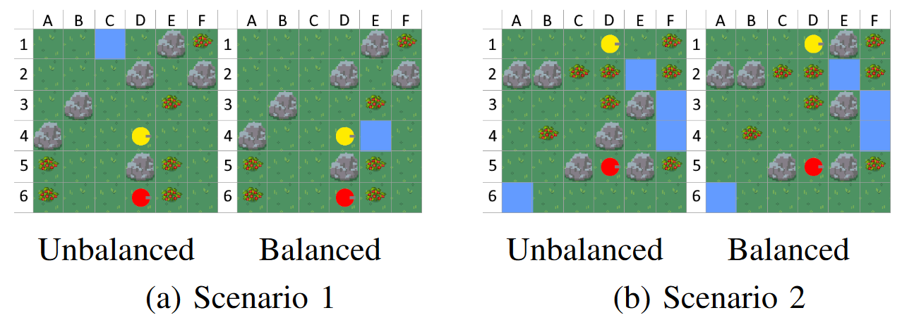
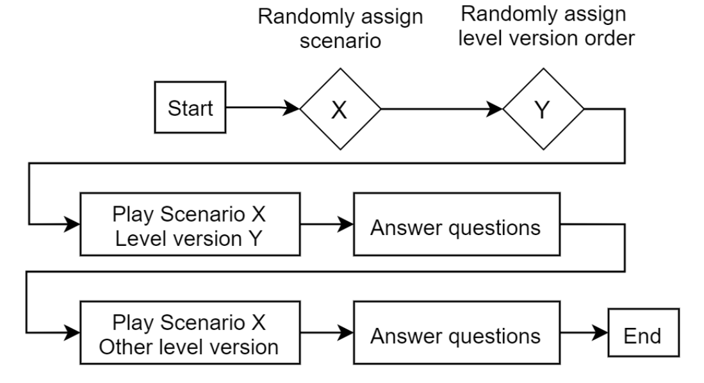

# It might be balanced, but is it actually good? An Empirical Evaluation of Game Level Balancing

This is the repository for supplementary files for the paper "It might be balanced, but is it actually good? An
Empirical Evaluation of Game Level Balancing" accepted at the IEEE Conference on Games 2024 in Milan, Italy.

**Paper abstract:** Achieving optimal balance in games is essential to their success, yet reliant on extensive manual
work and playtesting. To facilitate this process, the Procedural Content Generation via Reinforcement Learning (PCGRL)
framework has recently been effectively used to improve the balance of existing game levels.
This approach, however, only assesses balance heuristically, neglecting actual human perception.
For this reason, this work presents a survey to empirically evaluate the created content paired with human playtesting.
Participants in four different scenarios are asked about their perception of changes made to the level both before and
after balancing, and vice versa.
Based on descriptive and statistical analysis, our findings indicate that the PCGRL-based balancing positively
influences players' perceived balance for most scenarios, albeit with differences in aspects of the balancing between
scenarios.

<div style="text-align:center;">
<p align="center">
    
</p>
</div>

### The repository contains:

* The catalog of all survey questions.
* For each scenario:
    * The level (tile map) of both versions, the unbalanced and balanced each.
    * The cleaned survey data per item (question) regarding the unbalanced and balanced version respectively.
    * Violin plots of the data distributions per item of the unbalanced and balanced version.

## Survey overview

The design of the survey. Each participant is randomly assigned a scenario and which version of the level to play first.

<div style="text-align:center;">
<p align="center">
    
</p>
</div>


## Citing this paper

```
@inproceedings{rupp_balanced_2024,
  author={Rupp, Florian and Puddu, Alessandro and Becker-Asano, Christian and Eckert, Kai},
  booktitle={2024 IEEE Conference on Games (CoG)}, 
  title={It might be balanced, but is it actually good? An Empirical Evaluation of Game Level Balancing}, 
  year={2024},
  pages={1-4},
  keywords={Surveys;Procedural generation;Statistical analysis;Games;Reinforcement learning;Manuals;Optimization;game balancing;playtesting;survey;human evaluation},
  doi={10.1109/CoG60054.2024.10645642}}
```

This work evaluates levels generated by the method proposed in the following conference and extended journal paper:

```
Journal Paper:
@article{rupp_simulation_2024,
  author={Rupp, Florian and Eberhardinger, Manuel and Eckert, Kai},
  journal={IEEE Transactions on Games}, 
  title={Simulation-Driven Balancing of Competitive Game Levels with Reinforcement Learning}, 
  year={2024},
  volume={},
  number={},
  pages={1-11},
  doi={10.1109/TG.2024.3399536}}

Conference Paper:
@inproceedings{rupp_balancing_2023,
  author={Rupp, Florian and Eberhardinger, Manuel and Eckert, Kai},
  booktitle={2023 IEEE Conference on Games (CoG)}, 
  title={Balancing of competitive two-player Game Levels with Reinforcement Learning}, 
  year={2023},
  pages={1-8},
  doi={10.1109/CoG57401.2023.10333248}}
```
